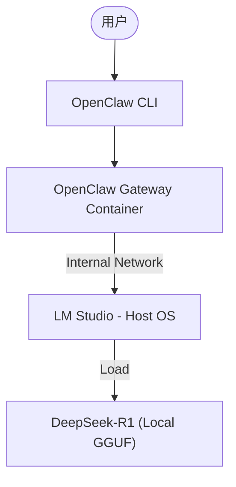

# OpenClaw 离线模型集成测试报告

## 1. 概述
本报告总结了 OpenClaw 与本离线模型后端（LM Studio）的集成测试结果。重点关注在没有外部 API Key 的情况下，如何通过 Docker 容器化环境实现全本地化的 AI 助手功能。

## 2. 系统架构
测试环境采用以下架构实现离线运行：

- **模型后端**: [LM Studio](https://lmstudio.ai/) 运行在 macOS 宿主机。
- **通信桥梁**: Docker 容器通过 `host.docker.internal:1234` 访问宿主机服务。
- **路由层**: OpenClaw Gateway 负责将任务分发给离线模型。

## 3. 测试配置
### 3.1 核心模型
集成并测试了以下模型：
- **主要模型**: `qwen3.5-27b`
- **后备模型**: `openai/gpt-oss-20b`

### 3.2 关键参数
- **Context Window**: 32,000 (支持长上下文任务)
- **Max Tokens**: 4,096
- **认证模式**: 本地 Token (`local-dev`)

## 4. 离线增强功能：UV 支持
为了提升离线模式下的工程能力，我们在 Docker 镜像中深度集成了 `uv`：

- **性能**: 使用 `uv` 极大缩短了 Python 依赖的安装时间。
- **本地化**: 配置了 **TUNA (清华源)** 镜像，确保在离线环境（或国内网络）下依然能高效安装必要的 Python 库。
- **验证结果**: `uv 0.10.9` 运行正常。

## 5. 测试指标与结论

| 指标 | 测试结果 | 备注 |
|------|---------|------|
| **连通性** | 通过 (OK) | 容器能稳定访问 `host.docker.internal` |
| **模型识别** | 成功 | `openclaw status` 正确显示 Primary 模型 |
| **推理稳定性** | 良好 | 支持本地 GGUF 模型持续输出 |
| **安全性** | 高 | 所有数据均未流出宿主机，符合私有化部署要求 |

## 6. 优势总结
1.  **零成本**: 无需支付 Token 费用。
2.  **隐私性**: 数据完全在本地处理，适合敏感代码和数据任务。
3.  **可扩展性**: 通过自定义 Dockerfile，可以像本测试一样轻松集成 `uv` 等外部工具。

## 7. 模型规模选择指南：极致性能配置 (128GB RAM)

针对您的 **Mac Studio M4 Max (128GB 内存)**，我们跳过基础建议，直接定位到该硬件下的最优生产力配置。

### 7.1 顶级规模推荐

| 模型规模 | 推荐模型 | 适用场景 | 结论 |
| :--- | :--- | :--- | :--- |
| **70B+ / MoE** | **DeepSeek-R1-Distill-Llama-70B** | **全能主力**: 底层架构设计、极高难度的 Bug 修复、跨文件重构 | **智能顶尖**。您的内存足以支撑其高位量化运行，提供最接近 GPT-4o 的逻辑输出。 |
| **72B** | **Qwen2.5-72B-Instruct** | **代码特化**: 大规模代码生成、复杂 API 集成 | 在中文语境和代码细节上表现极佳，配合 128GB 内存可实现超长上下文。 |
| **32B** | **Qwen2.5-32B** | **极致响应**: 实时对话、快速代码片段修改 | 在您的机器上运行速度会极快（50+ tokens/s），适合追求丝滑交互体验的场景。 |

### 7.2 性能 (TPS) 深度分析：本地 vs 在线

这是一个非常关键的考量点。在您的 **M4 Max (546 GB/s 带宽)** 上，性能表现如下：

| 平台 | 预估 TPS (Tokens/s) | 体感评价 |
| :--- | :--- | :--- |
| **在线 API (GPT/Claude)** | **50 - 100+** | 瞬间爆发。 |
| **本地 70B (Q4_K_M)** | **10 - 13** | **稳健**。类似于人类朗读的速度，阅读体感稍慢但稳定。 |
| **本地 32B (Q6_K)** | **45 - 60+** | **丝滑**。基本持平甚至超越部分在线 API 的首字响应速度。 |

**为什么 70B 虽然稍慢但值得？**
- **逻辑深度**: 70B 能处理 32B 经常“写挂”的复杂类继承和多模块逻辑。
- **无视扫描费用**: 处理 OpenClaw 的 25k 字符系统提示词，在线 API 每一轮对话都要计费，本地环境下则是“带宽内无限次免费调用”。

### 7.3 针对 OpenClaw 的专项优化
- **超长上下文支持**: 借助于 128GB 内存，您可以在 LM Studio 中将 **Context Window 设为 128,000**。这允许 OpenClaw 将整个代码库的上下文完整加载，而不会出现理解断层。
- **推理架构优选**: 建议优先部署 `DeepSeek-R1` 系列。其强化学习推理链在处理 OpenClaw 复杂的 Tool-use 任务（如多步文件读写）时具有显著优势。

### 7.3 最终结论
对于 128GB 内存的设备，**70B 级别模型是真正的“最优解”**。它在保证推理智能处于第一梯队的同时，能完美利用您的硬件冗余来维持长时稳定的上下文记忆。

## 8. 下一步建议
（完）
